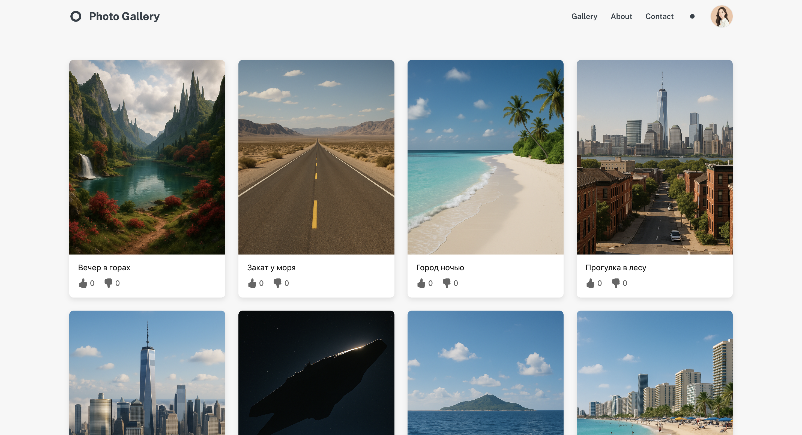
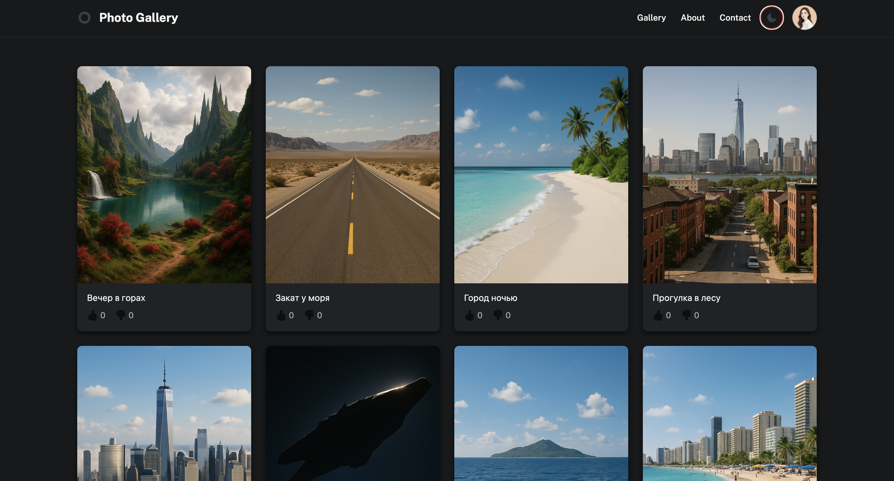
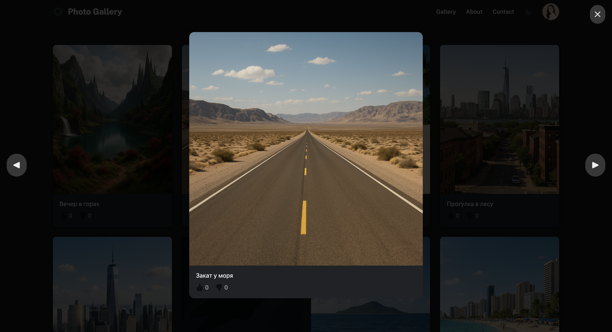

# 📸 Photo Blog

Минималистичный фотоблог-галерея с поддержкой светлой и тёмной темы, лайков/дизлайков и просмотром фотографий в модальном окне.  
Проект вдохновлён современными соцсетями (Instagram-like), но выполнен в стиле **фотокарточек-полароидов**. Проект доступен [по ссылке](https://bigvovaruu.github.io/photo_blog/)





---

## 🚀 Возможности

- 📷 Галерея из 9 квадратных фото (`img/img1.png` … `img/img9.png`).
- 🖼️ Фото открываются в модальном окне с:
  - кнопками навигации (стрелки влево/вправо, поддержка клавиатуры и свайпов);
  - подписью к фото.
- 👍👎 Лайки и дизлайки:
  - можно поставить только один лайк или один дизлайк;
  - повторный клик снимает реакцию;
  - состояние сбрасывается при перезагрузке.
- 🌙☀️ Поддержка светлой и тёмной темы:
  - автоматическая подстройка под системные настройки;
  - переключатель темы в шапке.
- 📱 Полностью адаптивный дизайн.

---

## 🛠️ Технологии

- **HTML5** — структура проекта  
- **CSS3 (TailwindCSS + кастомные стили)** — стилизация, адаптив  
- **JavaScript (Vanilla JS)** — логика модалки, лайков, тем и галереи  

---

## 📂 Структура проекта
```bash
photo_blog/
│
├── index.html       # Главная страница
├── styles.css       # Кастомные стили
├── script.js        # Логика проекта
│
├── img/             # Изображения галереи
│   ├── img1.png
│   ├── img2.png
│   └── … img9.png
│
└── icon/            # Иконки
├── like.svg
└── deslike.svg
```
---

## ⚡ Запуск проекта

1. Склонируй репозиторий:
   ```bash
   git clone https://github.com/username/photo_blog.git
   cd photo_blog
   ```

2.	Просто открой index.html в браузере.
Никаких дополнительных зависимостей не требуется.

---

✨ Будущие улучшения
	•	Режим «слайд-шоу» в модальном окне.
	•	Блок пользовательских комментариев под фото.
	•	Анимация изменения количества лайков/дизлайков.

---

📜 Лицензия

Свободно к использованию и модификации.